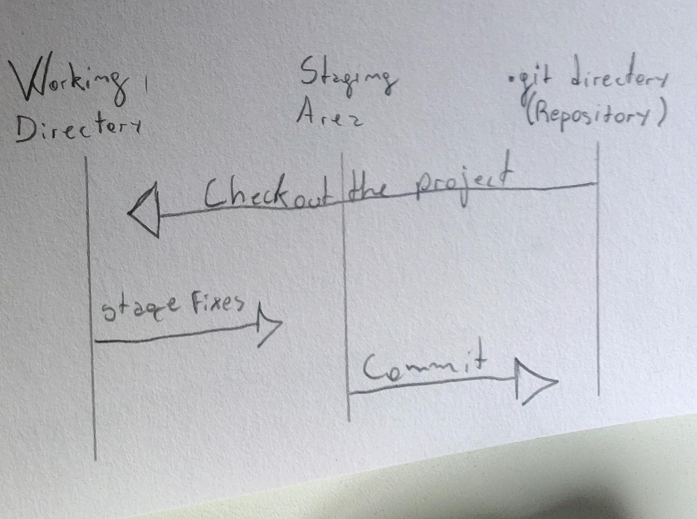

Cheatsheet for GIT - NOV17

GIT is an open source version control system designed to facilitate collaboration on development projects. This cheatsheet summarizes what I learned to do with it until now.

Overview of Git characteristics:

The three main states of Git:

Installing GIT on Ubuntu:

    1.Open Terminal and type:

        $ sudo apt-get update
        $ sudo apt-get install git
    2.Verify if the installation is correct by typing:
        $ git --version

Configure Git username and email with following commands. Replace "Name Example" and email with your own.

    $ git config --global user.name "Name Example"

    $ git config --global user.email "nexample@atlassian.com

Forking a repository:

As a way of proposing changes to GitHub repository without threatening the main source, you can fork it with the following steps:

    1.On GitHub.com, navigate to the octocat/Spoon-Knife repository.
    
    2.In the top-right corner of the page, click Fork. Fork button
    
    3.Select an owner for the forked repository. 
     
    4.By default, forks are named the same as their parent repositories. You can change the name of the fork to 
    distinguish it further.
    
    5.Optionally, add a description of your fork.
    
    6.Choose whether to copy only the default branch or all branches to the new fork. For many forking scenarios, such as contributing to open-source projects, you only need to copy the default branch. By default, only the default branch is copied.
    
    7.Click Create fork.

After forking a repository on GitHub you can clone this version to your local file system with the command:
    git clone <url of the forked repository>

Having changed or added files to your local repository, you can upload these alterations with the following procedures:
    
    1. On terminal, open your working directory and type the command:
        git add --all (to place all modified files in Git staging area (see pic1))
        git add <specific file> (to place a specific file in Git staging area)
    
    2. After that, the files placed in the staging area have to be committed, that is,
    a permanent snapshot of the current state of the repository associated with a unique identifier is made through the command:
        git commit
    The command git commit requires a message describing the snapshot/changes you made in that commit. A commit message serves the purpose of informing collaborators why and which changes were made.

Until now we only worked on the local copy of the repository. To upload the changes made to your local git repo files to the version of your repository in GitHub, you are going to use the command:
    git push

For the upload to be authorized, you are prompted to fill your username and passwords (a token since 2021).
Visiting your GitHub repository after this, you will notice that your changes are reflected there and also be able to see a full commit history for your repository.

